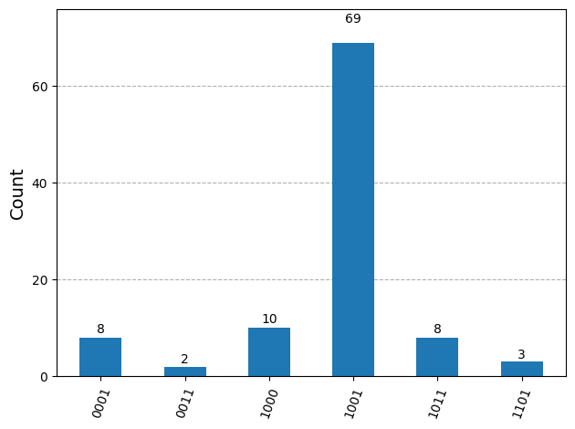
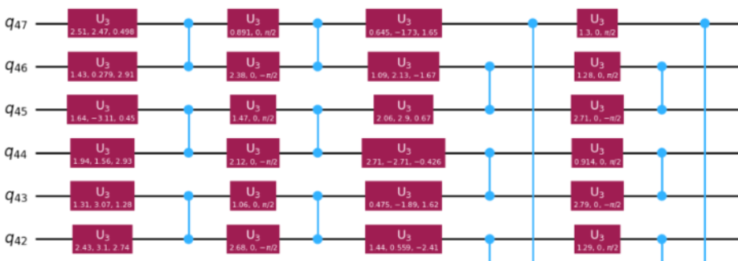
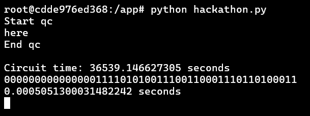

## BlueQubit Quantum Hackathon at YQuantum 2025

## Peak Circuits - Hidden Bitstring Challenge
Peaked circuits are a way to achieve verifiable quantum advantage. They produce a non-uniform output. After measurement, one of the all possible bitstrings has the highest outcome.

## Problem Statement
Given a QASM circuit, the task is to return the bitstring with the highest frequency.

## Methodology
The methodology for each problem of the challenge is explained.

**Problem - 1: Little Peak** 
The circuit used 4 qubits. It was run on Bluequbit using the CPU option. 100 shots were used. The maximum frequency string was found using the results obtained. The answer was _1001_. 

**Problem - 2: Swift Rise** 
The circuit used 28 qubits. It was run on Bluequbit using the CPU option. The number of shots were increased to 1024 as the number of bitstrings is 2^28. The maximum frequency string was found using the results obtained. The answer was _1100101101100011011000011100_.

**Problem - 3: Sharp Peak** 
The circuit used 44 qubits. It was run on Bluequbit using the mps.cpu option. This is because the maximum number of qubits supported by the CPU option is 35, and mps.cpu supports upto 96. Further, the number of shots were increased to 1024 as the number of bitstrings is 2^44. The maximum frequency string was found using the results obtained. The answer was _000000000000000111101010011100110001110110100011_.

**Problem 4: Golden Mountain, Problem 5: Granite Summit, and Problem 6: Titan Pinnacle** 

We approached this problem using 5 different methods to identify the distinct peak bitstring. While none produced a clearly dominant peak, several approaches yielded promising and informative results.

1) Circuit Cutting: Vertical
Assumption: the amplitude of the peaked quantum state increases faster than non-peaked quantum states as we progress in time => Divide the circuit into smaller blocks and run the simulation only on the first block as an approximation. 

2) Circuit Cutting Horizontal:
Check the connectivity of the qubits and partition them into different connected components. Run simulations on these different connected components​. Concatenate the result from each connect component to create the peaked quantum state.

3) Quantum Rings Simulation
mps.cpu is not enough. The number of two-qubit gates were more than 1000, and this is not supported by mps.cpu. To overcome this, we tried using QuantumRings simulator which supports simulation of upto 200 qubits on a 32/64 GB machine. However, even their simulator failed to provide a correct output even after running for 16 hours 53 minutes. This approach was unsuccessful for challenge , however, successful for challenge 3. 

4) IBM Real Backend Run(ibm_kyiv)
In this experiment, the P5_granite_summit.qasm circuit is executed on a real IBM Quantum backend using Qiskit Runtime’s SamplerV2 primitive. The circuit is first transpiled with hardware-aware optimizations using generate_preset_pass_manager, then submitted to the quantum device with 1000 measurement shots. The experiment uses QiskitRuntimeService to automatically select the least busy available backend, ensuring efficient job execution. The resulting measurement counts are retrieved and analyzed to identify the most frequently observed output state. This validates the circuit under realistic noise and device constraints and showcases integration with IBM’s production-grade quantum infrastructure.

5) Quimb, MPS
This experiment simulates the P5_granite_summit.qasm circuit using the qiskit-quimb package, which converts Qiskit circuits into Quimb-compatible tensor networks. Specifically, the circuit is modeled using a CircuitMPS representation, allowing for efficient sampling of measurement outcomes even on large circuits with limited entanglement. The quimb_circuit() function is used to perform the conversion, followed by .sample() to generate bitstring outputs from the MPS-contracted network. This approach demonstrates how tensor network methods can scale circuit simulation beyond the limits of traditional statevector-based simulators.

## Solution Notebooks
Problems 1, 2, 3: submission1.ipynb
Problems 4, 5, 6: Present in the Folder

## Challenges We Ran Into
1) Memory and runtime limitations while simulating deep, highly entangled circuits using MPS and tensor network methods.
2) Long queue times and noise on IBM real hardware made precise measurement difficult and introduced uncertainty in identifying the correct peak.

3) Cutting complex circuits manually (in vertical/horizontal strategies) introduced edge cases and required custom parsing of entanglement structure.

4) Simulators crashing due to large two-qubit gate counts, particularly in the QuantumRings approach.

5) Observable design and post-processing were nontrivial when using circuit cutting and Move-based reconstruction, especially when ancilla qubits were introduced.

## Accomplishments That We're Proud Of
1) Running a large, realistic quantum circuit on both simulated and real backends, and explored multiple non-trivial cutting and approximation techniques.

2) Integrated modern tools including qiskit-quimb, IBM Runtime, and Move-based wire cutting — combining academic theory (like arXiv:2302.03366) with applied engineering.

3) Developed a flexible analysis pipeline to identify the most likely bitstring ("peak") under varied quantum simulation methods.

## What We Learned
1) The structure and connectivity of a quantum circuit have a huge impact on which simulation technique is viable.

2) Tensor network methods like MPS can offer efficient alternatives to statevector simulation, but break down under too much entanglement or gate density.

3) Real-device runs offer unique challenges due to noise and decoherence but are essential for validating simulations.
Circuit cutting — both vertical and horizontal — requires careful observable tracking and thoughtful post-processing to reconstruct meaningful results.

## What’s Next for Last Minute
1) Extend the pipeline to support automated observable generation post-cutting.

2) Explore hardware-aware circuit rewriting before cutting, to reduce sampling overhead.

3) Implement quasiprobability reconstruction error bounds to better quantify vertical cut accuracy.

4) Try emerging simulators like TensorCircuit, Cirq + qsim, or Qiskit Braket integrations for scaling to 50+ qubits.
